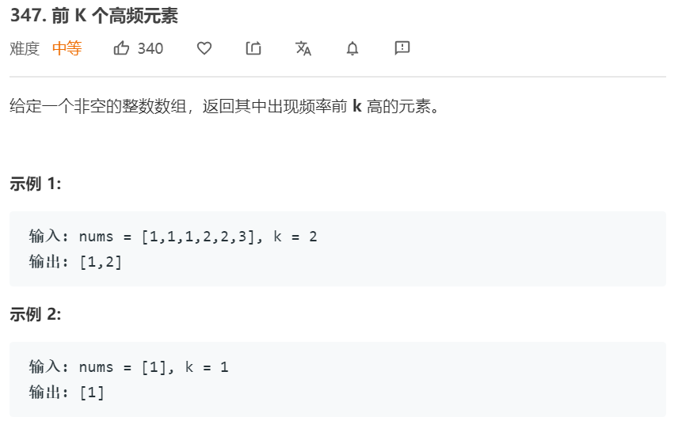

## 堆
>堆是计算机科学中一类特殊的数据结构的统称。堆通常是一个可以被看做一棵树的数组对象。堆总是满足下列性质：
 堆中某个节点的值总是不大于或不小于其父节点的值；
 堆总是一棵完全二叉树。

将根节点最大的堆叫做最大堆或大根堆，根节点最小的堆叫做最小堆或小根堆。常见的堆有二叉堆、斐波那契堆等

n个结点的堆，高度`d=logn`。根为第0层，则第层结点个数为2<sup>i</sup>，考虑一个元素在堆中向下移动的距离，这种算法时间代价为Ο（n)
由于堆有层深，插入结点、删除普通元素和删除最小元素的平均时间代价和时间复杂度都是`O(logn)`

堆是优先队列的底层实现
应用: 在M个元素中选取前N位元素

### 最大堆

用数组来存储数据, 实现一个最大堆

```java
import java.util.ArrayList;
public class MaxHeap<E extends Comparable<E>> {
    public static void main(String[] args) {
        MaxHeap mh = new MaxHeap();
        mh.add(100);
        mh.add(200);
        mh.add(30);
        mh.add(40);
        System.out.println(mh.extractMax());
        System.out.println(mh.extractMax());
        System.out.println(mh.extractMax());
        System.out.println(mh.extractMax());
    }
    private ArrayList<E> data;
    public MaxHeap(int capacity) {
        data = new ArrayList<>(capacity);
    }
    public MaxHeap() {
        data = new ArrayList<>();
    }
    public int size() {
        return data.size();
    }
    public boolean isEmpty() {
        return data.isEmpty();
    }
    public void add(E e) {
        data.add(e);
        shiftUp(data.size() -1);
    }
    public E findMax() {
        if(isEmpty()) {
            throw new RuntimeException("heap is empty!");
        }
        return data.get(0);
    }
    public E extractMax() {
        if(isEmpty()) {
            throw new RuntimeException("heap is empty!");
        }
        E max = data.remove(0);
        if(size() > 1) {
            E last = data.remove(size() -1);
            data.add(0,last);
            shiftDown(0);
        }
        return max;
    }
    // 从下往上堆化
    private void shiftUp(int i) {
        while(i > 0 && data.get(parent(i)).compareTo(data.get(i)) < 0) {
            swap(i, parent(i));
            i = parent(i);
        }
    }
    private void shiftDown(int i) {
        while(leftChild(i) < size()) {
            int j = leftChild(i);
            if(j+1 < size() && data.get(j).compareTo(data.get(j+1)) < 0) {
                j++;
            }
            if(data.get(i).compareTo(data.get(j)) >= 0) {
                break;
            }
            swap(i, j);
            i = j;
        }
    }
    private void swap(int i, int j) {
        E ie = data.get(i);
        data.set(i, data.get(j));
        data.set(j, ie);
    }
    private int parent(int i) {
        if(i == 0) {
            throw new IllegalArgumentException("root node has no parent!");
        }
        return (i-1) / 2;
    }
    private int leftChild(int i) {
        return 2*i + 1;
    }
    private int rightChild(int i) {
        return 2*i + 2;
    }
}

```

### 优先队列

用上文实现的最大堆来实现一个优先队列

```java
interface Queue<E> {
    int size();
    boolean isEmpty();
    void enqueue(E e);
    E dequeue();
    E peek();
}
public class PriorityQueue<E extends Comparable<E>> implements Queue<E> {
    MaxHeap<E> maxHeap;
    public PriorityQueue() {
        maxHeap = new MaxHeap<>();
    }
    @Override
    public int size() {
        return  maxHeap.size();
    }
    @Override
    public boolean isEmpty() {
        return  maxHeap.isEmpty();
    }
    @Override
    public E peek() {
        return maxHeap.findMax();
    }
    @Override
    public void enqueue(E e) {
        maxHeap.add(e);
    }
    @Override
    public E dequeue() {
        return maxHeap.extractMax();
    }
}
```

java的PriorityQueue是一个最小堆

### 堆排序

我们已经构建了堆，现在直接用堆来排序吧 

原地堆排序

```java
public class HeapSort {
    public static void main(String[] args) {
        int[] arr = new int[]{300,10, 40, 100,50, 60, 40};
        heapSort(arr, arr.length);
        for (int i = 0; i < arr.length; i++) {
            System.out.println(arr[i]);
        }
    }
    public static void heapSort(int[] arr, int n) {
        // 1. heapify 从第一个非叶子节点的开始shiftDown,这个时间复杂度是O(n)
        for (int i = (n - 1) / 2; i >=0; i--) {
            shiftDown(arr, i, n);
        }
        // 2. sort，每次都把最大的元素也就是第一个元素和最后一个元素交换，然后对[0,i]这部分区间开始shiftDown
        for(int i = n - 1; i > 0; i--) {
            swap(arr,0, i);
            shiftDown(arr, 0, i);
        }
    }
    private static void shiftDown(int[] arr, int k , int n) {
        while( 2*k + 1 < n) {
            int l = 2 *k + 1;
            if(l + 1 < n && arr[l + 1] > arr[l]) {
                l += 1;
            }
            if(arr[k] > arr[l]) {
                break;
            }
            swap(arr, k , l);
            k = l;
        }
    }
    private static void  swap(int[] arr, int i, int j) {
        int ie = arr[i];
        arr[i] = arr[j];
        arr[j] = ie;
    }
}

```


索引堆：待续

### LeetCode题解

#### [347. 前 K 个高频元素](https://leetcode-cn.com/problems/top-k-frequent-elements/)

题目



题解

```java
class Solution {
    public int[] topKFrequent(int[] nums, int k) {
        TreeMap<Integer,Integer> map = new TreeMap<>();
        for(int num: nums) {
            if(map.containsKey(num)) {
                map.put(num, map.get(num) + 1);
            } else {
                map.put(num, 1);
            }
        }
        PriorityQueue<Integer> pq = new PriorityQueue<Integer>(new Comparator<Integer>(){
            @Override
            public int compare(Integer a, Integer b) {
                return map.get(a) - map.get(b);
            }
        });
        for(Integer key: map.keySet()) {
            if(pq.size() < k) {
                pq.add(key);
            } else if(map.get(key) > map.get(pq.peek())) {
                pq.remove();
                pq.add(key);
            }
        }
        int[] arr = new int[pq.size()];
        int count = pq.size() - 1;
        while(!pq.isEmpty()){
            arr[count--] = pq.remove();
        }
        return arr;
    }
}
```

