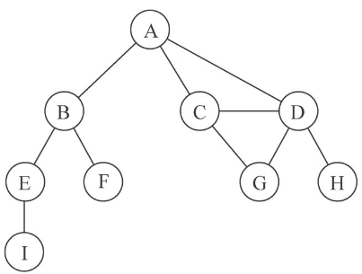
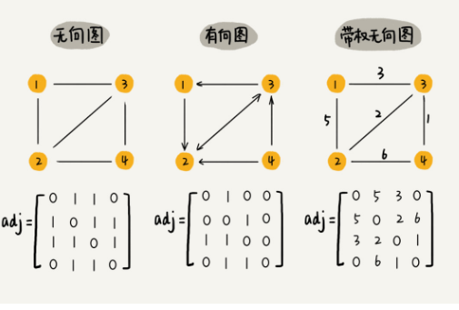
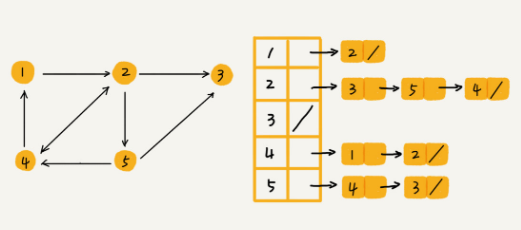
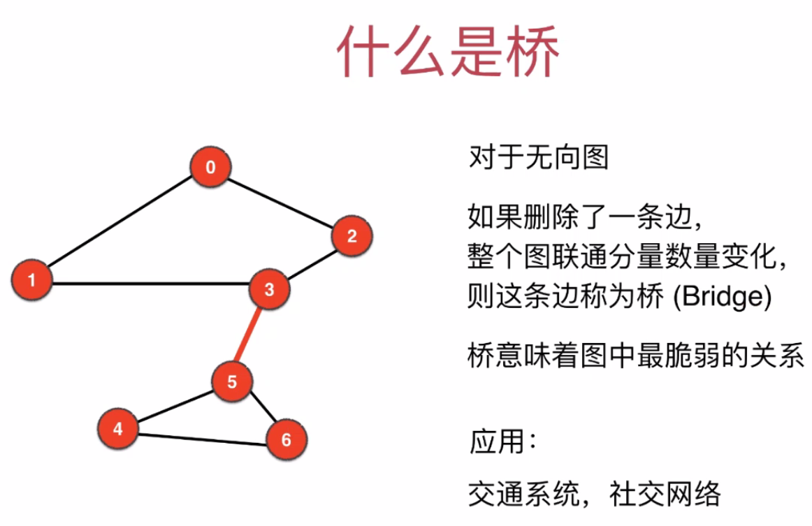

# 图

图的相关问题：图的表示，图的遍历，深度优先搜索，广度优先搜索，最小生成树，最短路径

图的分类： 有权图，无权图，有向图，无向图

## 图的基本概念

图是一组由**边**连接的**节点**（或**顶点**）。

任何社交网络，例如微博，微信，都可以用图来表示。

我们还可以使用图来表示道路、航班以及通信状态

一个图*G* = (*V*, *E* )由以下元素组成。

- *V*：一组顶点

- *E*：一组边，连接*V* 中的顶点

  


  

  

由一条边连接在一起的顶点称为**相邻顶点**。比如，A和B是相邻的，A和E不是相邻的。

一个顶点的**度**是其相邻顶点的数量。比如，A和其他三个顶点相连接，因此，A的度为3；E和其他两个顶点相连，因此，E的度为2。

**路径**是顶点*v*1, *v*2,…,*vk*的一个连续序列，以上图为例，其中包含路径A B E I和A C D G。

如果图中不存在环，则称该图是**无环的**。如果图中每两个顶点间都存在路径，则该图是**连通的**


## 有向图和无向图

图可以是**无向的**（边没有方向）或是**有向的**（有向图）。下图为有向图：


如果图中每两个顶点间在双向上都存在路径，则该图是**强连通的**。例如，C和D是强连通的，而A和B不是强连通的。

## 有权图和无权图

图还可以是**未加权的**或是**加权的**。如下图所示，有权图的边被赋予了权重值：


## 图的表示

第一种方法： 邻接矩阵



如果是稀疏图，这种表示方法就很浪费内存了，这种空间复杂度是O(V*V),  其实现实生活中基本都是稀疏图。所以我们一般用邻接表来表示

第二种方法： 邻接表



邻接矩阵存储方法的缺点是比较浪费空间，但是优点是查询效率高，而且方便矩阵运算。邻接表存储方法中每个顶点都对应一个链表，存储与其相连接的其他顶点。尽管邻接表的存储方式比较节省存储空间，但链表不方便查找，所以查询效率没有邻接矩阵存储方式高。针对这个问题，邻接表还有改进升级版，即将链表换成更加高效的动态数据结构，比如平衡二叉查找树、跳表、散列表等

#### 图的代码表示

无权无向图

```java
public class Graph {
    private int v;
    private Map<Integer, List<Integer>> adj;

    public Graph(int v) {
        this.v = v;
        adj = new HashMap<>(v); // 邻接表
        for (int i = 0; i < v; i++) {
            adj.put(i, new LinkedList<>());
        }
    }

    public void addEdge(int s, int e) {
        if (validateV(s) && validateV(e)) {
            adj.get(s).add(e);
            adj.get(e).add(s);
        }

    }
}
```

## 图的遍历

### DFS

#### 深度优先遍历DFS及运用

应用：求联通分量，判断两点是否联通，求一个顶点到另外一个顶点的路径，无向图中的环检测, 二分图的检测

```java
import java.util.*;

public class Graph {
    private int v;
    private Map<Integer, List<Integer>> adj;

    public Graph(int v) {
        this.v = v;
        adj = new HashMap<>(v); // 邻接表
        for (int i = 0; i < v; i++) {
            adj.put(i, new LinkedList<>());
        }
    }

    public void addEdge(int s, int e) {
        if (validateV(s) && validateV(e)) {
            adj.get(s).add(e);
            adj.get(e).add(s);
        }

    }

    // 验证定点是否有效
    public boolean validateV(int s) {
        if (s < 0 || s >= v) {
            throw new RuntimeException("unValid vertex");
        }
        return true;
    }

    // 遍历这个图
    public void dfsGraph() {
        int[] visited = new int[v];
        for (int i = 0; i < v; i++) {
            visited[i] = -1;
        }
        int ccid = 0; // 联通分量的个数
        for (int i = 0; i < v; i++) {
            if (visited[i] == -1) {
                dfs(i, visited, ccid);
                ccid++;
            }
        }
        //visited有两个功能，一是避免重复遍历， 二是存储定点的联通分量标记
        for (int i = 0; i < v; i++) {
            System.out.println(visited[i]);
        }
    }

    private void dfs(int i, int[] visited, int ccid) {
        visited[i] = ccid;
        List<Integer> list = adj.get(i);
        for (int v : list) {
            if (visited[v] == -1) {
                dfs(v, visited, ccid);
            }
        }
    }

    // 判断两个顶点是否相连，也就是在一个联通分量中
    public boolean isConnected(int s, int t) {
        if (!validateV(s) || !validateV(t)) {
            return false;
        }
        boolean[] visited = new boolean[v];
        for (int i = 0; i < v; i++) {
            visited[i] = false;
        }
        return dfs(s, t, visited);
    }

    private boolean dfs(int s, int t, boolean[] visited) {
        visited[s] = true;
        if (s == t) return true; // 找到目标就不再遍历
        List<Integer> list = adj.get(s);
        for (int v : list) {
            if (!visited[v]) {
                if (dfs(v, t, visited)) {
                    return true;
                }
            }
        }
        return false;
    }

    // 一个顶点到另外一个顶点的路径
    public List<Integer> path(int s, int t) {
        List<Integer> res = new ArrayList<>();
        if (!isConnected(s, t)) return res;
        int[] pre = new int[v];
        for (int i = 0; i < v; i++) {
            pre[i] = -1;
        }
        dfs(s, s, t, pre);
        // 从目标到源点
        int curr = t;
        while (curr != s) {
            res.add(curr);
            curr = pre[curr];
        }
        res.add(curr);
        Collections.reverse(res);
        return res;
    }

    // pre储存每个顶点的上一个顶点，同时也可以作为是否顶点是否遍历的判断条件
    private void dfs(int s, int parent, int t, int[] pre) {
        pre[s] = parent;
        if (s == t) {
            return;
        }
        List<Integer> list = adj.get(s);
        for (int v : list) {
            if (pre[v] == -1) {
                dfs(v, s, t, pre);
            }
        }
    }

    // 无向图中的环检测
    public boolean isHasCircle() {
        boolean[] visited = new boolean[v];
        for (int i = 0; i < v; i++) {
            visited[i] = false;
        }
        for (int i = 0; i < v; i++) {
            if (!visited[i]) {
                if (dfs(visited, i, i)) {
                    return true;
                }
            }
        }
        return false;
    }

    private boolean dfs(boolean[] visited, int s, int parent) {
        visited[s] = true;
        for (int v : adj.get(s)) {
            if (!visited[v]) {
                if (dfs(visited, v, s)) {
                    return true;
                }
                // 如果v被访问过, 而且不是当前访问节点的上一个节点
            } else if (v != parent) {
                return true;
            }
        }
        return false;
    }

    // 检测二分图，二分图可以分成两部分，每一条边均连接不同部分的顶点
    public boolean isBiGraph() {
        boolean[] visited = new boolean[v];
        int[] colors = new int[v];
        for (int i = 0; i < v; i++) {
            visited[i] = false;
            colors[i] = -1;
        }
        for (int i = 0; i < v; i++) {
            if (!visited[i]) {
                if (!dfs(i, 0, visited, colors)) {
                    return false;
                }
            }
        }
        return true;
    }

    private boolean dfs(int s, int color, boolean[] visited, int[] colors) {
        visited[s] = true;
        colors[s] = color;
        for (int v : adj.get(s)) {
            if (!visited[v]) {
                return dfs(v, 1 - color, visited, colors);
                // 如果边两端颜色相同，那么就不是二分图
            } else if (colors[v] == color) {
                return false;
            }
        }
        return true;
    }
}

```

### BFS

#### 广度优先遍历BFS及运用

```java []
package com.graph;

import java.util.*;

public class GraphBFS {
    private int v;
    private Map<Integer, List<Integer>> adj;

    public GraphBFS(int v) {
        this.v = v;
        adj = new HashMap<>(v); // 邻接表
        for (int i = 0; i < v; i++) {
            adj.put(i, new LinkedList<>());
        }
    }

    public void addEdge(int s, int e) {
        if (validateV(s) && validateV(e)) {
            adj.get(s).add(e);
            adj.get(e).add(s);
        }

    }

    // 验证顶点是否有效
    public boolean validateV(int s) {
        if (s < 0 || s >= v) {
            throw new RuntimeException("unValid vertex");
        }
        return true;
    }

    // 遍历整个图 时间复杂度 O(V + E)
    public void bfsGraph() {
        List<Integer> path = new ArrayList<>(v);
        int[] visited = new int[v];
        for (int i = 0; i < v; i++) {
            visited[i] = -1;
        }
        int ccid = 0;
        // 图可能有多个联通分量, 这里的处理和DFS相似
        for (int i = 0; i < v; i++) {
            if (visited[i] == -1) {
                bfs(i, visited, ccid);
                ccid++;
            }
        }
        for (int i = 0; i < v; i++) {
            System.out.println(visited[i]);
        }
    }

    private void bfs(int s, int[] visited, int ccid) {
        Queue<Integer> queue = new LinkedList<>();
        queue.add(s);
        visited[s] = ccid;
        while (!queue.isEmpty()) {
            int e = queue.poll(); // 取出队头元素
            for (int w : adj.get(e)) {
                if (visited[w] == -1) {
                    // 入队
                    queue.add(w);
                    // 标记为已访问，避免重复入队，每个顶点只入队，出队一次
                    visited[w] = ccid;
                }
            }
        }
    }

    // 判断两个顶点是否相连，也就是在一个联通分量中
    public boolean isConnected(int s, int t) {
        if (!validateV(s) || !validateV(t)) {
            return false;
        }
        boolean[] visited = new boolean[v];
        Queue<Integer> queue = new LinkedList<>();
        queue.add(s);
        visited[s] = true;
        while (!queue.isEmpty()) {
            int e = queue.poll(); // 取出队头元素
            if (e == t) {
                return true;
            }
            for (int w : adj.get(e)) {
                if (!visited[w]) {
                    // 入队
                    queue.add(w);
                    // 标记为已访问，避免重复入队，每个顶点只入队，出队一次
                    visited[w] = true;
                }
            }
        }
        return false;
    }

    // 使用BFS求单源路径
    public List<Integer> singleSourcePath(int s, int t) {
        List<Integer> res = new ArrayList<>();
        if (!isConnected(s, t)) return res;
        int[] pre = new int[v];
        boolean[] visited = new boolean[v];
        Queue<Integer> queue = new LinkedList<>();
        queue.add(s);
        visited[s] = true;
        pre[s] = s;
        while (!queue.isEmpty()) {
            int e = queue.poll(); // 取出队头元素
            if (e == t) {
                break;
            }
            for (int w : adj.get(e)) {
                if (!visited[w]) {
                    // 入队
                    queue.add(w);
                    // 标记为已访问，避免重复入队，每个顶点只入队，出队一次
                    visited[w] = true;
                    pre[w] = e;
                }
            }
        }
        int curr = t;
        while (curr != s) {
            res.add(curr);
            curr = pre[curr];
        }
        res.add(curr);
        Collections.reverse(res);
        return res;
    }

    public boolean isHasCircle() {
        boolean[] visited = new boolean[v];
        for (int i = 0; i < v; i++) {
            visited[i] = false;
        }
        for (int i = 0; i < v; i++) {
            if (!visited[i]) {
                if (bfs(visited, i, i)) {
                    return true;
                }
            }
        }
        return false;
    }

    private boolean bfs(boolean[] visited, int s, int parent) {
        Queue<Integer> queue = new LinkedList<>();
        queue.add(s);
        visited[s] = true;
        while (!queue.isEmpty()) {
            int e = queue.poll(); // 取出队头元素
            for (int w : adj.get(e)) {
                if (!visited[w]) {
                    // 入队
                    queue.add(w);
                    // 标记为已访问，避免重复入队，每个顶点只入队，出队一次
                    visited[w] = true;
                } else if (w != parent) {
                    return true;
                }
            }
        }
        return false;
    }

    // 检测二分图，二分图可以分成两部分，每一条边均连接不同部分的顶点
    public boolean isBiGraph() {
        boolean[] visited = new boolean[v];
        int[] colors = new int[v];
        for (int i = 0; i < v; i++) {
            visited[i] = false;
            colors[i] = -1;
        }
        for (int i = 0; i < v; i++) {
            if (!visited[i]) {
                if (!bfs(i, visited, colors)) {
                    return false;
                }
            }
        }
        return true;
    }

    private boolean bfs(int s, boolean[] visited, int[] colors) {
        Queue<Integer> queue = new LinkedList<>();
        queue.add(s);
        visited[s] = true;
        colors[s] = 0;
        while (!queue.isEmpty()) {
            int e = queue.poll(); // 取出队头元素
            for (int w : adj.get(e)) {
                if (!visited[w]) {
                    // 入队
                    queue.add(w);
                    // 标记为已访问，避免重复入队，每个顶点只入队，出队一次
                    visited[w] = true;
                    colors[w] = 1 - colors[e];
                } else if (colors[w] == colors[e]) {
                    return false;
                }
            }
        }
        return true;
    }
}

```

BFS可以求无权图的两点之间的最短距离

## 图论建模

### leetcode题目

+ [785. 判断二分图](https://leetcode-cn.com/problems/is-graph-bipartite/)(done)
+ [695. 岛屿的最大面积](https://leetcode-cn.com/problems/max-area-of-island/)(done)
+ [200. 岛屿数量](https://leetcode-cn.com/problems/number-of-islands/)
+ [1020. 飞地的数量](https://leetcode-cn.com/problems/number-of-enclaves/)
+ [130. 被围绕的区域](https://leetcode-cn.com/problems/surrounded-regions/)
+ [733. 图像渲染](https://leetcode-cn.com/problems/flood-fill/)
+ [1034. 边框着色](https://leetcode-cn.com/problems/coloring-a-border/)
+ [529. 扫雷游戏](https://leetcode-cn.com/problems/minesweeper/)
+ [827. 最大人工岛](https://leetcode-cn.com/problems/making-a-large-island/)(hard)
+ [1091. 二进制矩阵中的最短路径](https://leetcode-cn.com/problems/shortest-path-in-binary-matrix/)(done)
+ [752. 打开转盘锁](https://leetcode-cn.com/problems/open-the-lock/)
+ [773. 滑动谜题](https://leetcode-cn.com/problems/sliding-puzzle/)(hard)

### 双向BFS
## 桥和割点
有难度，一般面试不会考桥




## 最小生成树

## 最短路径

无权图BFS

我们这里讨论有权图

有权图代码

```java
import java.util.TreeMap;
import java.util.Map;

public class WeightedGraph {
    private int V;
    private Map<Integer, Integer>[] adj;
    public WeightedGraph(int V) {
        this.V = V;
        adj = new TreeMap[V];
        for (int i = 0; i < V; i++) {
            adj[i] = new TreeMap<>();
        }

    }
    public void validateVertex(int v) {
        if(v < 0 || v >= V) {
            throw new IllegalArgumentException("顶点无效");
        }
    }
    public void addEdge(int s, int e, int w) {
        validateVertex(s);
        validateVertex(e);
        adj[s].put(e, w);
        adj[e].put(s, w);
    }
    public int V() {
        return V;
    }
    // 返回该顶点相邻的顶点
    public Iterable<Integer> adj(int v)  {
        validateVertex(v);
        return adj[v].keySet();
    }
    // 两个顶点之间是否有边
    public boolean hasEdge(int s, int e) {
        validateVertex(s);
        validateVertex(e);
        return adj[s].containsKey(e);
    }
    // 求边的权重
    public int getWeight(int s, int e) {
        if(hasEdge(s, e)) {
            return adj[s].get(e);
        }
        throw new IllegalArgumentException(String.format("No edge %d-%d", s, e));
    }
}

```


## 迪杰斯特拉(Dijkstra)算法

处理无负权边的图

```java
import java.util.Arrays;

// 地杰斯特拉算法，求有权图的单源最短路径
public class Dijkstra {
    private WeightedGraph G;
    private int s;
    private boolean[] visited;
    private int[] dis;
    // 时间复杂度O(V*V)
    public Dijkstra(WeightedGraph G, int s) {
        G.validateVertex(s);
        int V = G.V();
        this.G = G;
        this.s = s;
        visited = new boolean[V];
        dis = new int[V];
        Arrays.fill(dis, Integer.MAX_VALUE);
        dis[s] = 0;
        while(true) {
            int currDis = Integer.MAX_VALUE;
            int curr = -1; //
            for (int i = 0; i < V; i++) {
                if(!visited[i] && dis[i] < currDis) {
                    currDis = dis[i];
                    curr = i;
                }
            }
            if(curr == -1) break;
            visited[curr] = true;
            for(int w: G.adj(curr)) {
                if(!visited[w]) {
                    if(dis[curr] + G.getWeight(curr, w) < dis[w]) {
                        dis[w] = dis[curr] + G.getWeight(curr, w);
                    }
                }
            }
        }
    }
    public boolean isConnectedTo(int v){
        G.validateVertex(v);
        return visited[v];
    }
    public int distTo(int v){
        G.validateVertex(v);
        return dis[v];
    }
    public static  void main(String[] args) {
        WeightedGraph g = new WeightedGraph(6);
        g.addEdge(0, 1, 7);
        g.addEdge(0, 2, 3);
        g.addEdge(0, 3, 1);
        g.addEdge(3, 1, 2);
        Dijkstra dij = new Dijkstra(g, 0);
        for (int v = 0; v < g.V(); v++)
            System.out.print(dij.distTo(v) + " ");
        System.out.println();
    }
}
```

改进复杂度

```java
import java.util.*;

// 时间复杂度O(ElogE),索引堆可以优化到O(ElogV)
public class Dijkstra2 {
    private WeightedGraph G;
    private int s;
    private int[] dis;
    private int[] pre;
    private boolean[] visited;

    class Node implements Comparable<Node> {
        int v;
        int dis;

        public Node(int v, int dis) {
            this.v = v;
            this.dis = dis;
        }

        @Override
        public int compareTo(Node another) {
            return dis - another.dis;
        }
    }

    public Dijkstra2(WeightedGraph G, int s) {

        this.G = G;

        G.validateVertex(s);
        this.s = s;

        dis = new int[G.V()];
        pre = new int[G.V()];
        visited = new boolean[G.V()];
        Arrays.fill(dis, Integer.MAX_VALUE);
        dis[s] = 0;// don not forget
        Arrays.fill(pre, -1);
        PriorityQueue<Node> queue = new PriorityQueue<>();
        queue.add(new Node(s, 0));
        pre[s] = s;
        while (!queue.isEmpty()) {
            int cur = queue.remove().v;
            if(visited[cur]) continue; // 重复节点放入
            visited[cur] = true;
            for (int w : G.adj(cur))
                if (!visited[w]) {
                    if (dis[cur] + G.getWeight(cur, w) < dis[w]) {
                        dis[w] = dis[cur] + G.getWeight(cur, w);
                        queue.offer(new Node(w, dis[w]));
                        pre[w] = cur;
                    }
                }
        }
    }

    public boolean isConnectedTo(int v) {

        G.validateVertex(v);
        return visited[v];
    }

    public int distTo(int v) {

        G.validateVertex(v);
        return dis[v];
    }

    public Iterable<Integer> path(int t) {

        G.validateVertex(t);
        List<Integer> res = new ArrayList<>();
        if(!isConnectedTo(t)) return res;
        int curr = t;
        while(curr != s) {
            res.add(curr);
            curr = pre[curr];
        }
        res.add(s);
        Collections.reverse(res);
        return res;
    }

    public static  void main(String[] args) {

        WeightedGraph g = new WeightedGraph(6);
        g.addEdge(0, 1, 7);
        g.addEdge(0, 2, 3);
        g.addEdge(0, 3, 1);
        g.addEdge(3, 1, 2);
        Dijkstra2 dij = new Dijkstra2(g, 0);
//        for (int v = 0; v < g.V(); v++)
//            System.out.print(dij.distTo(v) + " ");
        System.out.println(dij.path(1));
    }
}
```

### Bellmon-Ford算法	
